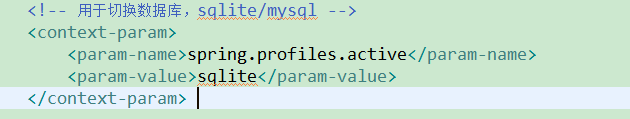

# guitar再次升级了(用的好可以给个Star哦！)

这次的版本实现了多个数据库切换（注意不是多个数据源同时使用，而是切换）

支持 ** SQL Server ** 、**DB2**、**SQLite**、**SQLite**、**MySQL**、**H2**等各大常见数据库一键切换，但这里只提供了MySql和SQLite的实现，如果想加入更多数据库只需修改配置文件applicationContext.xml加入新的数据库配置文件，并在mapper.xml提供对应版本的操作语句

# guitar3.0

吉他3.00

项目架构：SpringMVC+Mybatis+(SQLite|MySql)

IDE:Eclipse

## 1.0旧版本

请查看分支guitar-v1

[guitar-v1](https://github.com/mahui53541/guitar/tree/guitar-v1) 

## 2.0旧版本

请查看分支guitar-v2

[guitar-v2](https://github.com/mahui53541/guitar/tree/guitar-v2) 

## 演示

以下是搜索效果图(页面url:https://localhost/index.jsp)：

以下是添加和删除效果图（页面url:https://localhost/second.jsp）：

以下是测试代码以及演示效果（可在测试代码中切换数据库）

## 目录结构

## 数据库切换

#### 整个项目切换

修改web.xml文件，参数为（sqlite，mysql）

#### 测试代码切换

修改测试类注解，参数为（sqlite，mysql）

## 更新

打开命令行，进入guitar3.0根目录，执行以下命令：

	git pull

## 开源许可证
 MIT
